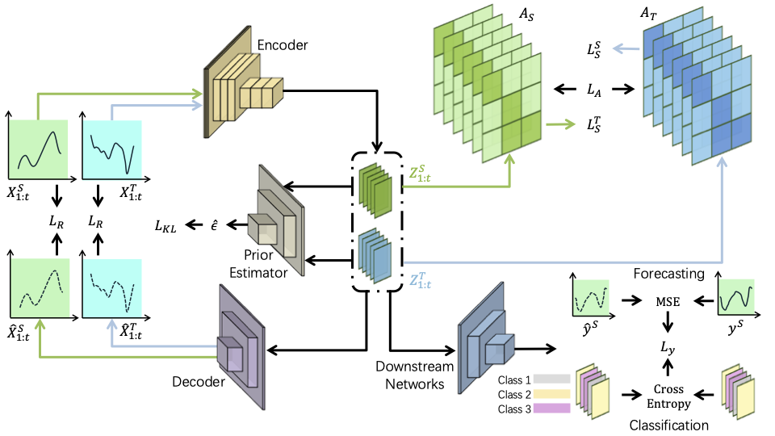

# Latent Causality Alignment(LCA)

The Latent Causality Alignment (LCA) is a model designed for time series domain adaptation. Based on the characteristic that high-dimensional data is generated by low-dimensional latent variables, it restores stable latent causal mechanisms and solves the difficulties faced by traditional methods in constructing causal structures when dealing with high-dimensional time series data. It has demonstrated good performance in time series classification and prediction tasks on multiple benchmark tests.

## Model


<p align="center">
  <b>Overall structure of LCA</b>
</p>

## Main Results


## Get Started

1. Set up the running environment. Install Python and PyTorch, see [Install](https://github.com/DMIRLAB-Group/LCA/blob/main/Install.md) for details.

2. Download data. You can obtain all the datasets from [[Google Drive(TSForcast)](https://drive.google.com/drive/folders/1wKhyKQDgnNwNNqfY4ox4Zu890uVZQ9_o?usp=sharing)] or [[AdaTime(TSClassif)](https://github.com/emadeldeen24/AdaTime)] or [[TranSVAE(VideoClassif)](https://github.com/ldkong1205/TranSVAE)].

3. Train the model. Run the script in the scripts directory, you can run the shell command to execute the experiment.Examples are as follows:
```shell
# cd TSForcast/
bash ./scripts/human_action.sh
# cd TSClassif/
bash ./scripts/HAR.sh
```